Displays data sets in a chart or a group of charts.

The chart control is based on the [plotly.js](https://plotly.com/javascript/)
graphs library.

<h2 class='h2'>Basic charts <a href='#'><svg xmlns="http://www.w3.org/2000/svg" viewBox="0 0 24 24"><path d="M4 11v2h12l-5.5 5.5 1.42 1.42L19.84 12l-7.92-7.92L10.5 5.5 16 11H4z"></path></svg> More basic charts</a></h2>
<ul class='list'>
    <li>
        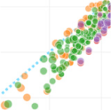
        <a href='#'>Scatter plots <svg xmlns="http://www.w3.org/2000/svg" viewBox="0 0 24 24"><path d="M4 11v2h12l-5.5 5.5 1.42 1.42L19.84 12l-7.92-7.92L10.5 5.5 16 11H4z"></path></svg></a>
    </li>
    <li>
        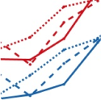
        <a href='#'>Line charts <svg xmlns="http://www.w3.org/2000/svg" viewBox="0 0 24 24"><path d="M4 11v2h12l-5.5 5.5 1.42 1.42L19.84 12l-7.92-7.92L10.5 5.5 16 11H4z"></path></svg></a>
    </li>
    <li>
        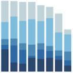
        <a href='#'>Bar charts <svg xmlns="http://www.w3.org/2000/svg" viewBox="0 0 24 24"><path d="M4 11v2h12l-5.5 5.5 1.42 1.42L19.84 12l-7.92-7.92L10.5 5.5 16 11H4z"></path></svg></a>
    </li>
    <li>
        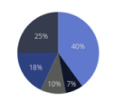
        <a href='#'>Pie charts <svg xmlns="http://www.w3.org/2000/svg" viewBox="0 0 24 24"><path d="M4 11v2h12l-5.5 5.5 1.42 1.42L19.84 12l-7.92-7.92L10.5 5.5 16 11H4z"></path></svg></a>
    </li>
    <li>
        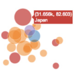
        <a href='#'>Bubble charts <svg xmlns="http://www.w3.org/2000/svg" viewBox="0 0 24 24"><path d="M4 11v2h12l-5.5 5.5 1.42 1.42L19.84 12l-7.92-7.92L10.5 5.5 16 11H4z"></path></svg></a>
    </li>
</ul>

<h2 class='h2'>Statistical charts <a href='#'><svg xmlns="http://www.w3.org/2000/svg" viewBox="0 0 24 24"><path d="M4 11v2h12l-5.5 5.5 1.42 1.42L19.84 12l-7.92-7.92L10.5 5.5 16 11H4z"></path></svg> More  statistical charts</a></h2>
<ul class='list'>
    <li>
        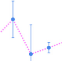
        <a href='#'>Error Bars <svg xmlns="http://www.w3.org/2000/svg" viewBox="0 0 24 24"><path d="M4 11v2h12l-5.5 5.5 1.42 1.42L19.84 12l-7.92-7.92L10.5 5.5 16 11H4z"></path></svg></a>
    </li>
    <li>
        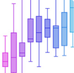
        <a href='#'>Box plots <svg xmlns="http://www.w3.org/2000/svg" viewBox="0 0 24 24"><path d="M4 11v2h12l-5.5 5.5 1.42 1.42L19.84 12l-7.92-7.92L10.5 5.5 16 11H4z"></path></svg></a>
    </li>
    <li>
        
        <a href='#'>Histograms <svg xmlns="http://www.w3.org/2000/svg" viewBox="0 0 24 24"><path d="M4 11v2h12l-5.5 5.5 1.42 1.42L19.84 12l-7.92-7.92L10.5 5.5 16 11H4z"></path></svg></a>
    </li>
    <li>
        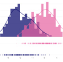
        <a href='#'>Distplots <svg xmlns="http://www.w3.org/2000/svg" viewBox="0 0 24 24"><path d="M4 11v2h12l-5.5 5.5 1.42 1.42L19.84 12l-7.92-7.92L10.5 5.5 16 11H4z"></path></svg></a>
    </li>
    <li>
        
        <a href='#'>2D histograms <svg xmlns="http://www.w3.org/2000/svg" viewBox="0 0 24 24"><path d="M4 11v2h12l-5.5 5.5 1.42 1.42L19.84 12l-7.92-7.92L10.5 5.5 16 11H4z"></path></svg></a>
    </li>
</ul>

<h2 class='h2'>Scientific charts <a href='#'><svg xmlns="http://www.w3.org/2000/svg" viewBox="0 0 24 24"><path d="M4 11v2h12l-5.5 5.5 1.42 1.42L19.84 12l-7.92-7.92L10.5 5.5 16 11H4z"></path></svg> More  scientific charts</a></h2>
<ul class='list'>
    <li>
        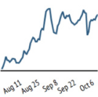
        <a href='#'>Contour plots <svg xmlns="http://www.w3.org/2000/svg" viewBox="0 0 24 24"><path d="M4 11v2h12l-5.5 5.5 1.42 1.42L19.84 12l-7.92-7.92L10.5 5.5 16 11H4z"></path></svg></a>
    </li>
    <li>
        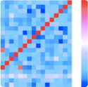
        <a href='#'>Heatmaps <svg xmlns="http://www.w3.org/2000/svg" viewBox="0 0 24 24"><path d="M4 11v2h12l-5.5 5.5 1.42 1.42L19.84 12l-7.92-7.92L10.5 5.5 16 11H4z"></path></svg></a>
    </li>
    <li>
        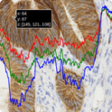
        <a href='#'>Imshow <svg xmlns="http://www.w3.org/2000/svg" viewBox="0 0 24 24"><path d="M4 11v2h12l-5.5 5.5 1.42 1.42L19.84 12l-7.92-7.92L10.5 5.5 16 11H4z"></path></svg></a>
    </li>
    <li>
        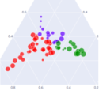
        <a href='#'>Ternary plots <svg xmlns="http://www.w3.org/2000/svg" viewBox="0 0 24 24"><path d="M4 11v2h12l-5.5 5.5 1.42 1.42L19.84 12l-7.92-7.92L10.5 5.5 16 11H4z"></path></svg></a>
    </li>
    <li>
        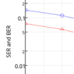
        <a href='#'>Log plots <svg xmlns="http://www.w3.org/2000/svg" viewBox="0 0 24 24"><path d="M4 11v2h12l-5.5 5.5 1.42 1.42L19.84 12l-7.92-7.92L10.5 5.5 16 11H4z"></path></svg></a>
    </li>
</ul>

<h2 class='h2'>Financial charts <a href='#'><svg xmlns="http://www.w3.org/2000/svg" viewBox="0 0 24 24"><path d="M4 11v2h12l-5.5 5.5 1.42 1.42L19.84 12l-7.92-7.92L10.5 5.5 16 11H4z"></path></svg> More  financial charts</a></h2>
<ul class='list'>
    <li>
        
        <a href='#'>Time series & date axes <svg xmlns="http://www.w3.org/2000/svg" viewBox="0 0 24 24"><path d="M4 11v2h12l-5.5 5.5 1.42 1.42L19.84 12l-7.92-7.92L10.5 5.5 16 11H4z"></path></svg></a>
    </li>
    <li>
        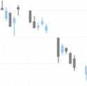
        <a href='#'>Candlestick charts <svg xmlns="http://www.w3.org/2000/svg" viewBox="0 0 24 24"><path d="M4 11v2h12l-5.5 5.5 1.42 1.42L19.84 12l-7.92-7.92L10.5 5.5 16 11H4z"></path></svg></a>
    </li>
    <li>
        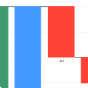
        <a href='#'>Waterfall charts <svg xmlns="http://www.w3.org/2000/svg" viewBox="0 0 24 24"><path d="M4 11v2h12l-5.5 5.5 1.42 1.42L19.84 12l-7.92-7.92L10.5 5.5 16 11H4z"></path></svg></a>
    </li>
    <li>
        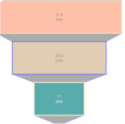
        <a href='#'>Funnel charts <svg xmlns="http://www.w3.org/2000/svg" viewBox="0 0 24 24"><path d="M4 11v2h12l-5.5 5.5 1.42 1.42L19.84 12l-7.92-7.92L10.5 5.5 16 11H4z"></path></svg></a>
    </li>
    <li>
        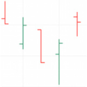
        <a href='#'>OHLC charts <svg xmlns="http://www.w3.org/2000/svg" viewBox="0 0 24 24"><path d="M4 11v2h12l-5.5 5.5 1.42 1.42L19.84 12l-7.92-7.92L10.5 5.5 16 11H4z"></path></svg></a>
    </li>
</ul>

<h2 class='h2'>Maps <a href='#'><svg xmlns="http://www.w3.org/2000/svg" viewBox="0 0 24 24"><path d="M4 11v2h12l-5.5 5.5 1.42 1.42L19.84 12l-7.92-7.92L10.5 5.5 16 11H4z"></path></svg> More  maps</a></h2>
<ul class='list'>
    <li>
        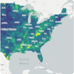
        <a href='#'>Mapbox Choropleth maps <svg xmlns="http://www.w3.org/2000/svg" viewBox="0 0 24 24"><path d="M4 11v2h12l-5.5 5.5 1.42 1.42L19.84 12l-7.92-7.92L10.5 5.5 16 11H4z"></path></svg></a>
    </li>
    <li>
        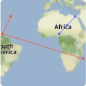
        <a href='#'>Lines on Mapbox <svg xmlns="http://www.w3.org/2000/svg" viewBox="0 0 24 24"><path d="M4 11v2h12l-5.5 5.5 1.42 1.42L19.84 12l-7.92-7.92L10.5 5.5 16 11H4z"></path></svg></a>
    </li>
    <li>
        
        <a href='#'>Filled area on Maps <svg xmlns="http://www.w3.org/2000/svg" viewBox="0 0 24 24"><path d="M4 11v2h12l-5.5 5.5 1.42 1.42L19.84 12l-7.92-7.92L10.5 5.5 16 11H4z"></path></svg></a>
    </li>
    <li>
        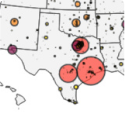
        <a href='#'>Bubble maps <svg xmlns="http://www.w3.org/2000/svg" viewBox="0 0 24 24"><path d="M4 11v2h12l-5.5 5.5 1.42 1.42L19.84 12l-7.92-7.92L10.5 5.5 16 11H4z"></path></svg></a>
    </li>
    <li>
        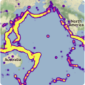
        <a href='#'>Mapbox density heatmap <svg xmlns="http://www.w3.org/2000/svg" viewBox="0 0 24 24"><path d="M4 11v2h12l-5.5 5.5 1.42 1.42L19.84 12l-7.92-7.92L10.5 5.5 16 11H4z"></path></svg></a>
    </li>
</ul>

## Properties

A chart control can hold several traces, that can display individual data sets.

To indicate properties for a given trace, you will use the indexed properties
(using the *property_name[index]* syntax, with the indices starting at index 1) to
specify which trace you target.

Indexed properties can have a default value (using the *property_name* syntax with
no index) which is overridden by any specified indexed property.

The _data_ property supported types are:

- pandas Dataframe
- list of lists
- numpy series
- list of pandas dataframes

## Usage

- [Basic concepts](charts/basics.md)
- [Other features](charts/others.md)
